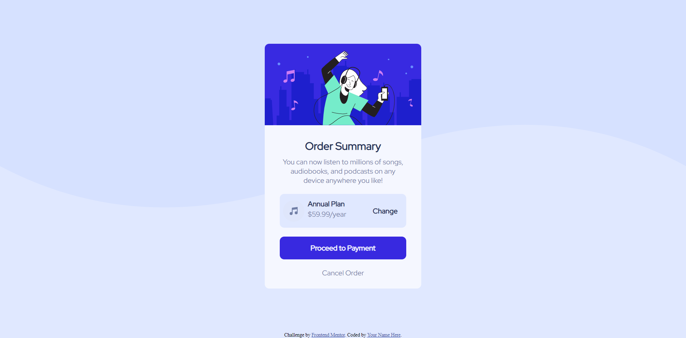
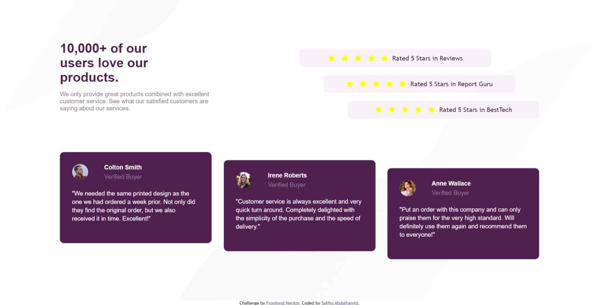
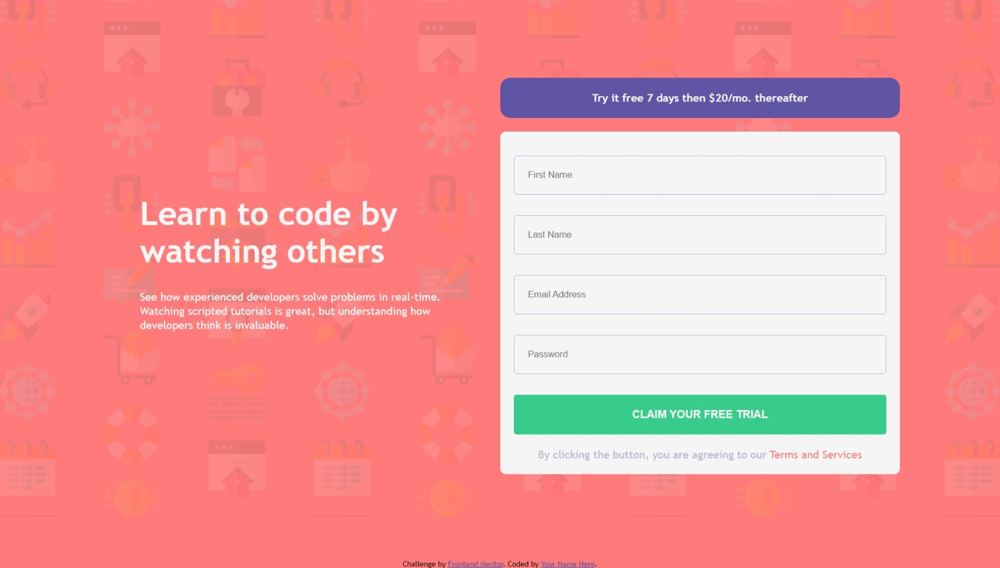
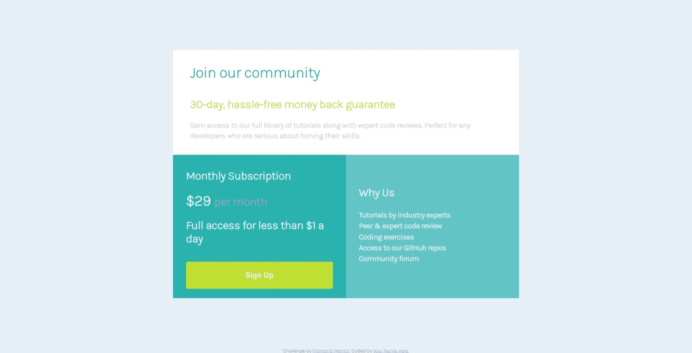
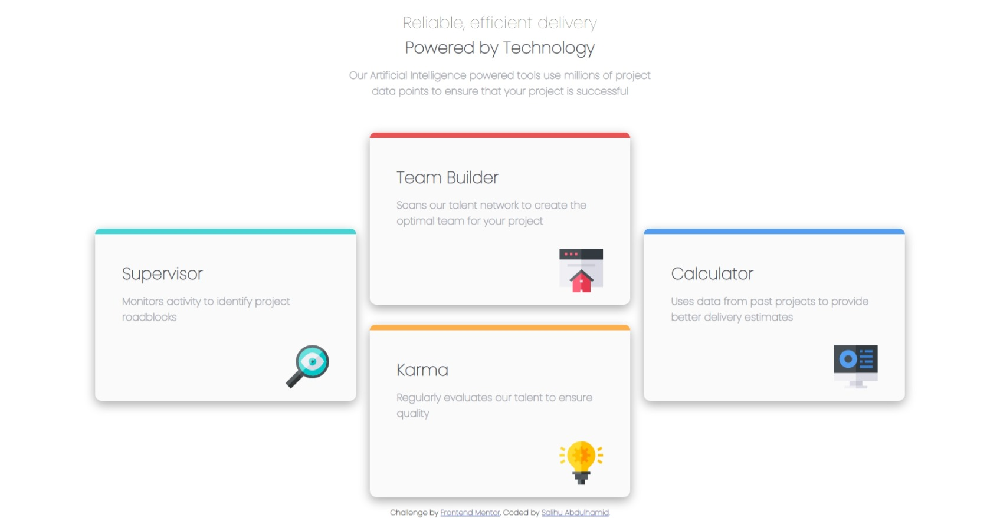
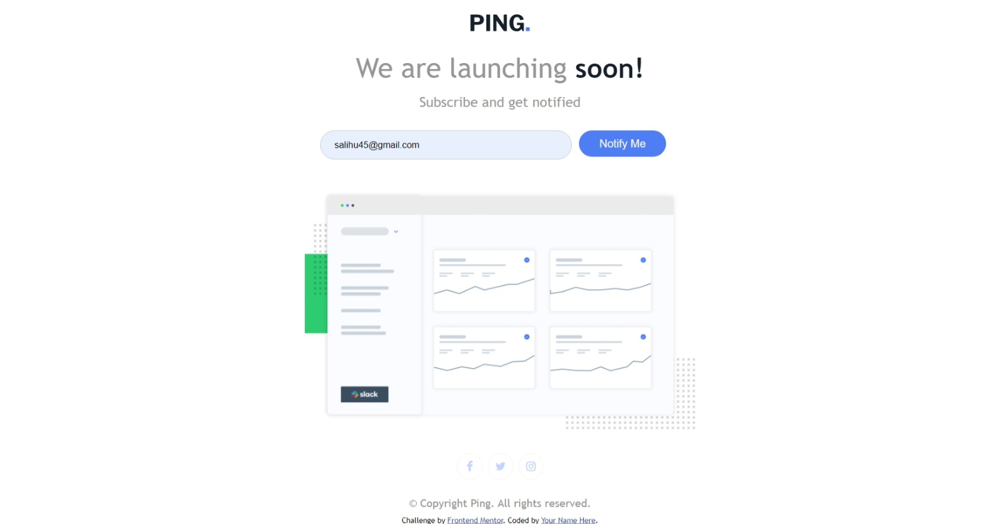
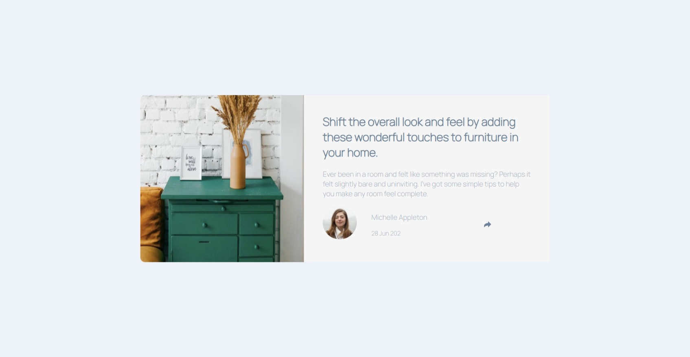
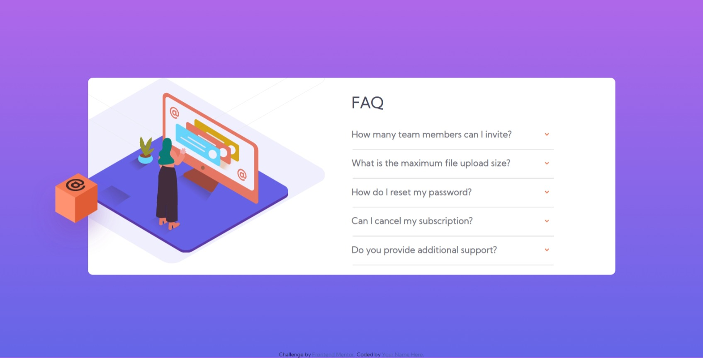
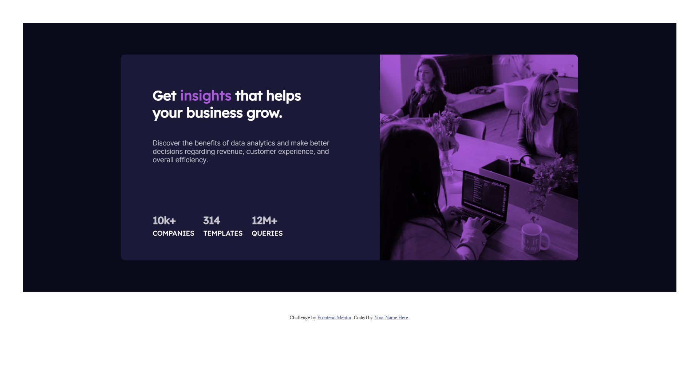
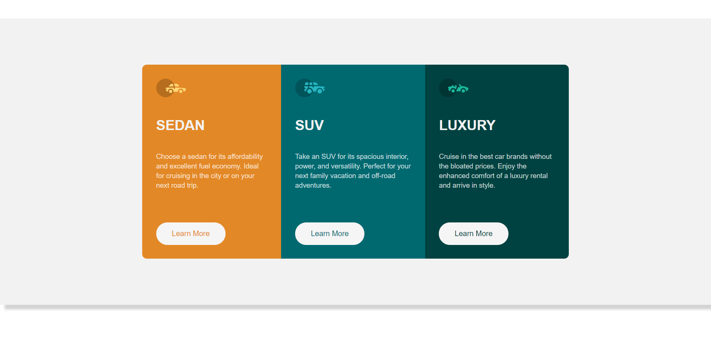

# Newbie
## Table of contents
- [Order-Summary-Component](#Order-Summary-Component)
- [Social-Proof-Section-Master](#Social-Proof-Section-Master)
- [Huddle-landing-page-with-single-introductory-section](#Huddle-landing-page-with-single-introductory-section)
- [Intro-component-with-sign-up-form](Intro-component-with-sign-up-form-solution)
- [Single-price-grid-component](Single-price-grid-component)
- [Profile-card-component-main](Profile-card-component-main)
- [Four-Card-Feature-Section](Four-Card-Feature-Section)
- [Ping-Coming-Soon-Page](Ping-Coming-Soon-Page)
- [Article-preview-component-master](Article-preview-component-master)
- [Faq-accordion-main](Faq-accordion-main)
- [Stats-preview-card](Stats-preview-card)
- [3-Column-Preview-card](3-Column-Preview-card)
- [Base-apparel-design](Base-apparel-design)

## Order-Summary-Component

### Links
- Solution URL: [GitHub Repository](https://github.com/Codedzephyr/order-summary-component-main)
- Live Site URL: [Live Site URL](https://tender-kilby-4c1bb5.netlify.app/)

## Social-Proof-Section-Master

### Links
- Solution URL: [GitHub Repository ](https://github.com/Codedzephyr/Social-proof-section-master)
- Live Site URL: [Live Site URL](https://nostalgic-wilson-24c329.netlify.app/)

## Huddle-landing-page-with-single-introductory-section

### Links
- Solution URL: [GitHub Repository](https://github.com/Codedzephyr/Hubble-landing-page-with-single-introductory-section)
- Live Site URL: [Live Site URL](https://optimistic-pike-b602f6.netlify.app/)

## Intro component with sign up form solution

### Links
- Solution URL: [GitHub Repository](https://github.com/Codedzephyr/Intro-compoenent-with-SignUp-form)
- Live Site URL: [Live Site URL](https://kind-lamarr-2c7891.netlify.app/)

## Single-price-grid-component

### Links
- Solution URL: [GitHub Repository](https://github.com/Codedzephyr/single-price-grid-component-master)
- Live Site URL: [Live Site URL](https://brave-goldwasser-0bdf08.netlify.app/)

## Profile-card-component-main

### Links
- Live Site URL: [Live Site URL](https://elastic-beaver-5e0f4b.netlify.app/)
- Solution URL: [GitHub Repository](https://github.com/Codedzephyr/Profile-card-component-main)

## Four-Card-Feature-Section

### Links
- Solution URL: [GitHub Repository](https://github.com/Codedzephyr/Four-Card-Feature-section)
- Live Site URL: [Live Site URL](https://tender-bell-e93747.netlify.app/)

## Ping-Coming-Soon-Page

### Links
- Solution URL: [GitHub Repository](https://github.com/Codedzephyr/ping-coming-soon-page-master)
- Live Site URL: [Live Site URL](https://epic-carson-9c172a.netlify.app/)

## Article-preview-component-master

### Links
- Live Site URL: [Live Site URL](https://priceless-johnson-d286b9.netlify.app/)
- Solution URL: [GitHub Repository](https://github.com/Codedzephyr/article-preview-component-master/edit/main/README.md)

## Faq-accordion-main

### Links
- Solution URL: [GitHub Repository](https://github.com/Codedzephyr/faq-accordion-card-main)
- Live Site URL: [live site URL](https://eloquent-aryabhata-ab5c36.netlify.app/)

## Stats-preview-card

### Links
- Live Site URL: [Live Site URL](https://amazing-ritchie-b68fed.netlify.app/)
- Solution URL: [GitHub Repository](https://github.com/Codedzephyr/Stats-preview-card)

## 3-Column-Preview-card

### Links
- Solution URL: [GitHub Repository](https://github.com/Codedzephyr/3-Column-Preview-card)
- Live Site URL: [Live Site](https://sleepy-bose-c3c763.netlify.app/)

## Base-apparel-design

### Links
- Solution URL: [GitHub Repository](https://github.com/Codedzephyr/Base-apparel-design)
- Live Site URL: [Live Site URL](https://modest-euclid-02fded.netlify.app/)
